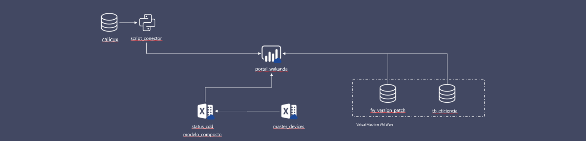

  

# Portal Wakanda
*Esteira de homologação* dos projetos do Centro de Desenvolvimento de Dispositivos Brasil | Vivo - Telefônica Brasil

Alguns projetos já estão prontos e rodando, outros em fase de desenvolvimento, como é o caso do Magic Mobile.

A forma como os dados se comunicam entre si e sua relação com as outras páginas estão detalhados na topologia abaixo. A figura que mostra a relação dos dados, também oferece uma visão dos projetos que estão por vir. Para maiores detalhes de como cada um opera de forma individual, basta seguir o respectivo link.

## Topologia

  

## Projetos:
Veja os projetos realizados no CDD Brasil:

* **Portal Wakanda:** https://github.com/gsfreitas/portal_wakanda/
* **Proyectos y KPI's Brasil:** 
* **CDD All in One:**
* **Magic Tool Mobile:** https://github.com/gsfreitas/magic_tool
