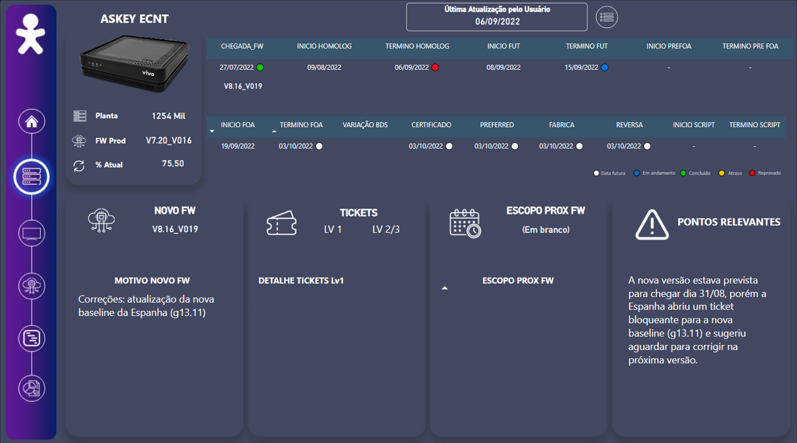
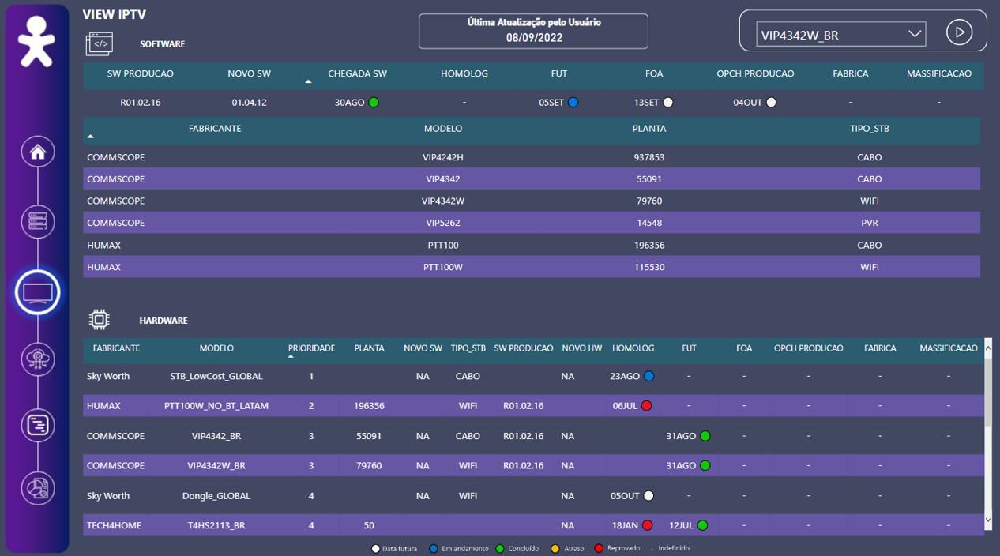

[](https://www.linkedin.com/in/gabrielsfreitas/)

<p align="center">
  
</p>

# Portal Wakanda
<sub>*Esteira de homologação* dos projetos do Centro de Desenvolvimento de Dispositivos Brasil | Vivo - Telefônica Brasil</sub>

<br/>
Projeto com o principal objetivo de facilitar a visualização de todo o processo de homologação, desde a chegada de um firmware até sua fase de execução dos scripts de massificação. Abaixo é possível observar como os dados se relacionam através da sua topologia.

Antes da existência do projeto, o CDD tinha os mesmos dados, mas estavam armazenados em fontes diferentes e não era intuitivo, o que gerava falha na comunicação entre as partes interessadas.

<br/>

## Topologia
<p align="center">
  
</p>

## Contexto:
Antes da existência do projeto, o CDD tinha os mesmos dados, mas estavam armazenados em fontes diferentes e não era intuitivo, o que gerava falha na comunicação entre as partes interessadas.

Para facilitar a comunicação e projetar o que está acontecendo com cada projeto, foi feito um portal reunindo todas as informações da maneira mais intuitiva possível. Também foi elaborado um formulário para que toda equipe possa sugerir o que pode melhorar ou acrescentar alguma informação.

<br/>

## Metodologia página principal:

Para tornar a leitura portal mais intuitiva, foram utilizados faróis para sinalizar o status de cada fase de um determinado dispositivo, ou seja, pode sinalizar uma data futura, uma aprovação ou até mesmo se está em atraso ou se um firmware foi reprovado. É importante ressaltar que para cada processo (seja ele na fase de laboratório ou piloto) há essas mesmas condições.

A lógica por trás de todas essas cores funciona da seguinte maneira:
* Aprovação / chegada de um firmware (farol verde): quando a data do firmware ou processo (lab ou piloto) for menor ou igual a data de hoje;
* Data futura (farol branco): quando a data de chegada de algum firmware ou processo é uma data maior que a data de hoje;
* Em andamento (farol azul): significa que algum processo está em andamento (seja de laboratório ou piloto). A lógica é que se a data atual está entre as datas de início e término do respectivo processo;
* Reprovado (farol vermelho): é quando o firmware de algum dispositivo é reprovado em alguma fase de homologação;
* Em atraso (farol amarelo): um firmware ou processo de homologação estava previsto para uma determinada data, mas houve um atraso, seja para a entrega ou início de alguma fase.

<br/>

* OBS.I: é possível interferir em cada fase, ou seja, mesmo que algum processo esteja com o status em andamento - ou qualquer outro -, é possível alterar para um diferente do atual (reprovado, atraso, etc.)
* OBS.II: se alguma das fases for reprovada, todas as fases subsequentes não irão mostrar as datas, já que não há lógica em projetar uma data - mesmo que seja futura -, para um firmware que foi reprovado em uma etapa anterior.

<br/>
<p align="center">
  
</p>

<br/>
<details><summary>Exemplo de código utilizado para uma das fases de piloto (FUT):</summary>
<p>

  ```
COND_IFUT = 
var DataHoje = TODAY()
var DataInicioFUT = MAX('Principal'[INICIO_FUT])
var DataTerminoFUT = MAX('Principal'[TERMINO_FUT])
var AtrasoFUT = MAX(Principal[ATRASO_FUT])
var AprovadoFUT = MAX(Principal[APROVADO_FUT])
var AprovadoHomolog = MAX(Principal[APROVADO_HOMOLOG])

var RESULTADO = 
    SWITCH(TRUE(),
    AprovadoHomolog = 1, "-",

    AtrasoFUT = 2, UPPER(FORMAT(DataInicioFUT, "DDMMM")) & "  " & "🟡", //está em atraso
    AprovadoFUT = 1 && AprovadoFUT <> BLANK(), UPPER(FORMAT(DataInicioFUT, "DDMMM")) & "  " & "🔴", //está reprovado
    DataInicioFUT <= DataHoje && DataHoje <= DataTerminoFUT, UPPER(FORMAT(DataInicioFUT, "DDMMM")) & "  " & "🔵", // homologação está em andamento
    DataTerminoFUT < DataHoje && DataTerminoFUT <> BLANK(), UPPER(FORMAT(DataInicioFUT, "DDMMM")) & "  " & "🟢", // FUT concluído
    DataInicioFUT > DataHoje, UPPER(FORMAT(DataInicioFUT, "DDMMM")) & "  " & "⚪", // é uma data futura

    ISBLANK(DataInicioFUT), "-" // se termino FUT não for preenchido
    )
    return RESULTADO
```
  
</p>
</details>
<br/>

## Metodologia ficha dispositivo:
Para cada projeto, há uma página específica com todas as informações a respeito dele. Exemplos de informações específica são:
* Quantidade de tickets abertos por nível de criticidade;
* Detalhamento dos tickets level 1;
* Escopo do próximo firmware;
* Data de término de cada etapa de homologação;
* Pontos relevantes;
* Quantidade de dispositivos na planta;
* Porcentagem de atualização do firmware em produção;
* Correções ou novas implementações do firmware candidate.

<br/>

<p align="center">
  
</p>

<br/>

Nesta página é importante destacar alguns pontos importantes:
* Novo FW: mostra o firmware candidate, ou seja, o firmware que está sendo testado;
* Motivo novo FW: descreve a razão pelo qual foi solicitada a versão que está sendo testada (a pergunta aqui é: por que estamos testando esse firmware?);
* Tickets: mostra a quantidade dos tickets abertos para a versão que está sendo testada, separados por nível de criticidade;
* Detalhes tickets lv. 1: como a prioridade é destacar os tickets que são mais críticos, esse bloco mostra detalhadamente cada ticket Lv.1 aberto;
* Data escopo: oferece uma visão da data para solicitar a próxima versão de firmware;
* Escopo próx. FW: mostra uma visão do que deve ser corrigido na próxima versão;
* Pontos relevantes: algo importante a ser comentado que aconteceu durante alguma etapa de homologação (ex.: explicar o motivo do atraso da chegada de um firmware).

<br/>

## Metologia página IPTV:
Para os projetos relacionados aos STB, basicamente a lógica aplicada foi a mesma. Contudo, foi dividido entre software e hardware. Essa divisão foi feita, uma vez que quando há a chegada de um software, ele é testado para todos os dispositivos que estão abaixo da linha principal. Por outro lado, quando algum hardware chega para ser testado, logicamente é testado individualmente, então cada projeto tem a sua fase separada e é tratado de maneira individual.

A maior parte dos dispositivos chegam até a fase de FUT (que engloba a data de início do FUT 1 e término de FUT 2), já o restante do processo é feito pela equipe de engenharia (FOA em diante).

Alguns dispositivos não possuem informações claras a respeito, como a quantidade em campo e porcentagem atualizado na versão em produção, uma vez que eles não são do Brasil (são projetos LATAM) e são consideradas informações confidenciais.

Abaixo, é possível visualizar a página com as informações de IPTV. É importante ressaltar que as nomenclaturas foram alteradas, como "preferred" para HGU, neste caso é "OPCH".


<br/>

<p align="center">
  
</p>

<br/>

## Metodologia Patch FW:
Com a finalidade de apontar as features em cada firmware, os dados dessa página são coletados das releases notes - enviadas pelos fabricantes Askey e Mitra - de todas as versões que o CDD possui atualmente.

Essa página serve para nos dar uma noção da evolução das melhorias implementadas nos firmwares. Um bom exemplo disso é que até a data da escrita desse artigo, não houve nenhum firmware com uma melhoria para o agente único por parte da Mitrastar, apenas pelos firmwares da Askey, a partir da versão S40. 

Com isso, é possível fornecer bagagem e argumentos suficientes para tomadores de decisão, no momento de cobrar alguma melhoria para a fabricante.

Novamente os faróis foram utilizados para fornecer uma visão mais intuitiva de quais features possuem em cada versão, separados por fabricantes e chipsets.


<br/>

<p align="center">
  
</p>

<br/>
